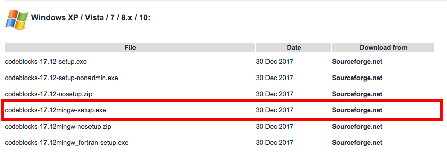
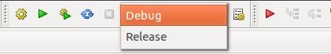

# CodeBlocks FAQ

## ¿Dónde instalar?:

[Pagina de descargas](http://www.codeblocks.org/downloads), ir al link que dice "Download the binary release" descargar el Codeblocks correspondiente a su plataforma.

Para Windows descargar Codeblocks con el compilador:
    codeblocks-17.12mingw-setup.exe

En caso de tener Mac, quizas sea mejor usar Xcode que se puede descargar en el App Store

## No me aparecen los menus con run, build, etc.

    View/Perspectives/Code::Blocks default

## El programa no me para en el breakpoint al hacer debug
Revisar que el Build Target sea Debug:

## Me aparece un error al intentar correr el programa
Revisar lo que dice el error.
Es posible que no tenga permisos para correr el ejecutable en la carpeta, intentar en otra carpeta como:

    /Documents/proyecto1

## ¿Cómo crear un proyecto?
En los menus de CodeBlocks

    File/New/Project...

Escoger
    Console application

Next
    c++
Escoger donde guardar el proyecto

En el compilador dejar lo que esta por defecto

