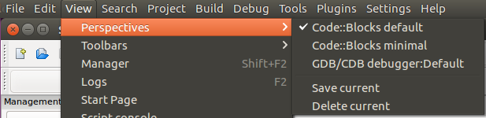

# CodeBlocks FAQ

## ¿Dónde instalar?:

[Pagina de descargas](http://www.codeblocks.org/downloads), ir al link que dice "Download the binary release" descargar el Codeblocks correspondiente a su plataforma.

En caso de tener Mac, quizas sea mejor usar Xcode que se puede descargar en el App Store

## ¿Cómo crear un proyecto?
En los menus de CodeBlocks

    File/New/Project...

Escoger
    Console application

Next
    c++
Escoger donde guardar el proyecto

En el compilador dejar lo que esta por defecto

## No me aparecen los menus con run, build, etc.

    View/Perspectives/Code::Blocks default

## ¿Cómo correr un programa?

## ¿Cómo hacer debug?

## El programa no me para en el breakpoint al hacer debug

## Me aparece un error al intentar correr el programa

